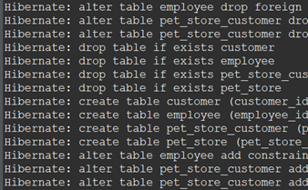

# Week 13 Coding Assignment — Pet Store REST API

### Overview

Over the next three weeks you will write code to build a Pet Store REST API. In this week's exercise you will write code for the first part of the Pet Store REST API.

## Objectives

This assignment has the following objectives:

1. Show that you can properly create an Entity Relationship Diagram (ERD), complete with entities and relationship lines.

2. Demonstrate how to create a Maven project.

3. Show how to modify the generic `pom.xml` with content created in the Spring Initializr Website.

4. Demonstrate that you can create Java Persistence API (JPA) entities.

5. Show understanding of Spring JPA configuration.

6. Demonstrate that you can create a Spring Boot main class that starts Spring Boot and configures itself as a Web application.

7. Show that the JPA entities can be used by Spring JPA to create schema tables complete with relationships.

## Output

This section describes the homework needed for week 13. In these exercises, you will build an Entity Relationship Diagram. Then, you will write the entities and configuration needed to start Spring JPA. You will create the main application class and run it. Then, you will demonstrate that the pet store tables have been created in the `pet_store` schema.

Here are the instructions for week 13. You will need to watch and understand the contents of the week 13 videos before attempting these exercises.

1. As you learned in the MySQL section, create an **Entity Relationship Diagram** (**ERD**) using Draw.io. **Save the ERD.** You can get the table descriptions from the **Spring Boot Simplified Homework Overview** document. This diagram will help you create the JPA entity classes.

2. In an Eclipse workspace of your choice, create a **Maven project** named **pet-store**.

3. In this step, you will overwrite `pom.xml` with the contents created by the Spring Initializr Website. In this way, you will get the dependencies needed to build the pet store application.

    - a) In a browser, navigate to https://start.spring.io.

    - b) Select: Maven project, Java language, and the latest General Availability version of Spring Boot 3. This will be a Spring Boot version without parentheses following the version (like RC1, SNAPSHOT, etc.). So, "3.0.5" and not "3.0.6 (SNAPSHOT)".

    - c) Set `Group` to `com.promineotech` or to your own name separated by dots.

    - d) Set `Artifact` to `pet-store`.

    - e) Set `Packaging` to `Jar` and `Java` to `17`.

    - f) Add the following dependencies: `web`, `jpa`, `mysql`, and `lombok`.

    - g) Click "Explore" and then "Copy".

    - h) In Eclipse, paste the clipboard contents into `pom.xml` in the project root directory, replacing the contents of the file. Save the file.

    - i) Right-click on the project name, then select "Maven" / "Update project". Click OK. This is an important step. Otherwise, Eclipse may not recognize the changes made to the POM file.

4. In this step you will create the **JPA entity classes** that will be used to create tables and manage table data.

    - a) Create the package `pet.store.entity`

    - b) In this package, create the three entity classes: `Customer`, `Employee`, and `PetStore`.

    - c) Remember to add the _`@Entity`_ (`jakarta.persistence`) and _`@Data`_ (`lombok`) class-level annotations.

    - d) Referencing your ERD, add the instance variables in each entity. Remember to convert the snake case table column names to camel case (so, "`customer_email`" in the table becomes "`customerEmail`" in the Java class).

    - e) Add the annotations _`@Id`_ (`jakarta.persistence`) and _`@GeneratedValue`_ (`jakarta.persistence`) to each ID field as shown in the videos.

    - f) Add the relationship variables into each class:

        | Class    | Relationship Variable     | Annotation                                                                                                                                                                                           |
        | -------- | ------------------------- | ---------------------------------------------------------------------------------------------------------------------------------------------------------------------------------------------------- |
        | Customer | `Set<PetStore> petStores` | `@ManyToMany(mappedBy = "customers", cascade = CascadeType.PERSIST)`                                                                                                                                 |
        | Employee | `PetStore petStore`       | `@ManyToOne(cascade = CascadeType.ALL)`, `@JoinColumn(name = "pet_store_id")`                                                                                                                        |
        | PetStore | `Set<Customer> customers` | `@ManyToMany(cascade = CascadeType.PERSIST)`, `@JoinTable(name = "pet_store_customer"`, `joinColumns = @JoinColumn(name = "pet_store_id")`, `inverseJoinColumns = @JoinColumn(name = "customer_id")` |
        | PetStore | `Set<Employee> employees` | `@OneToMany(mappedBy = "petStore", cascade = CascadeType.ALL, orphanRemoval = true)`                                                                                                                 |

    - g) Add _`@EqualsAndHashCode.Exclude`_ and _`@ToString.Exclude`_ to all of the recursive relationship variables. This will prevent recursion from occurring when the `.toString()`, `.equals()`, or `.hashCode()` methods are called.

5. In this step you will create the **application main class** that will start Spring Boot.

    - a) Create class `PetStoreApplication` in the `pet.store` package. (Make sure the class is in the `pet.store` package or you will have problems with the Component Scan.) Create the class with a `main()` method.

    - b) Add the _`@SpringBootApplication`_ (`org.springframework.boot.autoconfigure`) annotation.

    - c) Start Spring Boot from the `main()` method as shown in the videos.

6. In this step you will create the **application configuration**. This allows the application to login to the database and gives instructions to JPA.

    - a) In `src/main/resources`, create the file `application.yaml`. As shown in the videos, add the `spring.datasource` and `spring.jpa` sections. Make sure that the `spring.jpa` configuration correctly creates the application tables.

    - b) _You will need to update the Maven configuration or restart Eclipse to get Eclipse to sync correctly._

    - c) The configuration should look like this:

        ```yaml
        spring:
            datasource:
                username: pet_store
                password: pet_store
                url: jdbc:mysql://localhost:3306/pet_store

            jpa:
                hibernate:
                    ddl-auto: create
                show-sql: true
        ```

7. Now it's time to create the `pet_store` schema in the MySQL database. You will also create a user with a password and assign permissions. Make sure to watch the week 13 videos to learn how to do this correctly.

    - a) Use **MySQL Workbench** to create a schema named `pet_store`.

    - b) Create a user named `pet_store`, with password `pet_store` and all permissions except "grant option".

8. You will need to create a connection to the MySQL schema `pet_store` in DBeaver so that you can demonstrate that the tables were created properly.

    - a) In **DBeaver**, create a connection that connects to the `pet_store` schema. (See the week 3 videos for details.)

    - b) If you get an error "Public Key Retrieval is not allowed", click the "Driver properties" tab in the Connection Settings wizard. Then change "AllowPublicKeyRetrieval" to "true".

9. Run the application.

10. Using **DBeaver**, show that four tables were created: `customer`, `employee`, `pet_store`, and `pet_store_customer`.

## Observe

Follow the instructions for making a video submission for this coding assignment. Your video should, at a minimum, do the following:

-   Show the completed ERD with all entities and relationships.
-   Show that there are no tables in the `pet_store` schema. (You may need to drop the tables in DBeaver first.)
-   Run the application and show that the tables are created by the application.
-   Use DBeaver to show that the tables have been created and show the console output from Hibernate. The console output should look similar to this:

    
