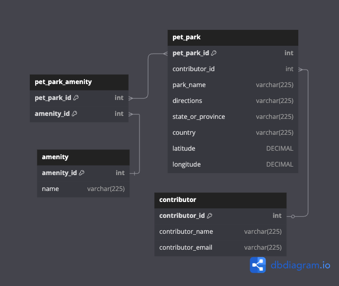

# Week 13: Intro to Sprint Boot — Pet Park API

Notes from the week 13 curriculum— using Sprint Boot to build a Pet Park API.

### Content

-   Introduction to **Maven**
-   How to create a **Spring Boot** project

## Introduction to Maven

-   Maven is a project **build** tool
-   We are using it for **dependency** _(Java code packaged in a library)_ management
-   Built-in to Eclipse

## Create a Spring Boot project

-   Navigate to `https://start.spring.io`
-   Build the **POM (Project Object Model)** file, using the latest version of Spring Boot 3.x
-   **Paste** it into the Maven project
-   Create the main application class file

#### Main application file:

```java
@SpringBootApplication
public class PetParkApplication {
    public static void main(String[] args) {
        SpringApplication.run(
            PetParkApplication.class, args);
    }
}
```

#### `@SpringBootApplication`:

-   Enables **Component Scan** — Spring will load classes and libraries, starting at the package in which the annotation is found
-   Enables **Auto-configuration**

### Component Scan

-   Boot looks at every class in the **main package** and all sub-packages
-   Determines if Spring should manage the class:
    -   Called a "managed Bean" or **Bean**
    -   Spring creates a **single** instance
    -   Stashes it in an object **repository**
    -   We can request an instance using `@Autowired`
-   We will then write a **controller** class
-   Spring's component scan will **map** HTTP requests to Java methods that we write
-   We use annotations to tell Spring which HTTP **verb** (internet requests) to map the method

### Auto-configuration

-   Spring Boot examines the **classpath** and the application configuration
-   It sets up **functionality** _(i.e. Web application)_ based on what it finds
-   Spring creates a Web application if it finds the **Tomcat** dependency
-   Tomcat is loaded by `spring-boot-starter-web`

## Create Database Schema

Use MySQL **Workbench** to create:

-   Schema
-   User with permissions

In **Eclipse**:

-   Create `application.yaml`
-   (Possibly install YAML — *"YAML Ain't Markup Language"* — editor)
-   Add database configuration

## Create Table Entities

### Video Content

-   A look at the Pet Park Locations Entity Relationship Diagram (ERD)
-   Create the **entities** that Spring Java Persistence API (Spring JPA) will use to create the schema tables
-   JPA will **create** the tables for us

### Pet Park ERD



### Create the JPA table entities

```java
@Entity // can specify the table name here
@Data
public class Contributor {
    @Id // primary key
    @GeneratedValue(strategy = ...)
    private Long contributorId;

    @Column(unique = true) // unique index
    private String contributorEmail;

    @OneToMany(mappedBy = ...)
    private Set<PetPark> petParks;
}
```

### Embed an object in an entity

-   Need to use the `@Embedded` annotation and then `@Embeddable` in the class that gets embedded

```java
@Entity
public class PetPark {
    @Embedded
    private GeoLocation geolocation;
}

@Embeddable
public class GeoLocation {
    // ...
}
```

<!-- ## Create Table Data -->

<!-- ## Create JPA Configuration -->

<!-- ## Create Contributor Operation -->
