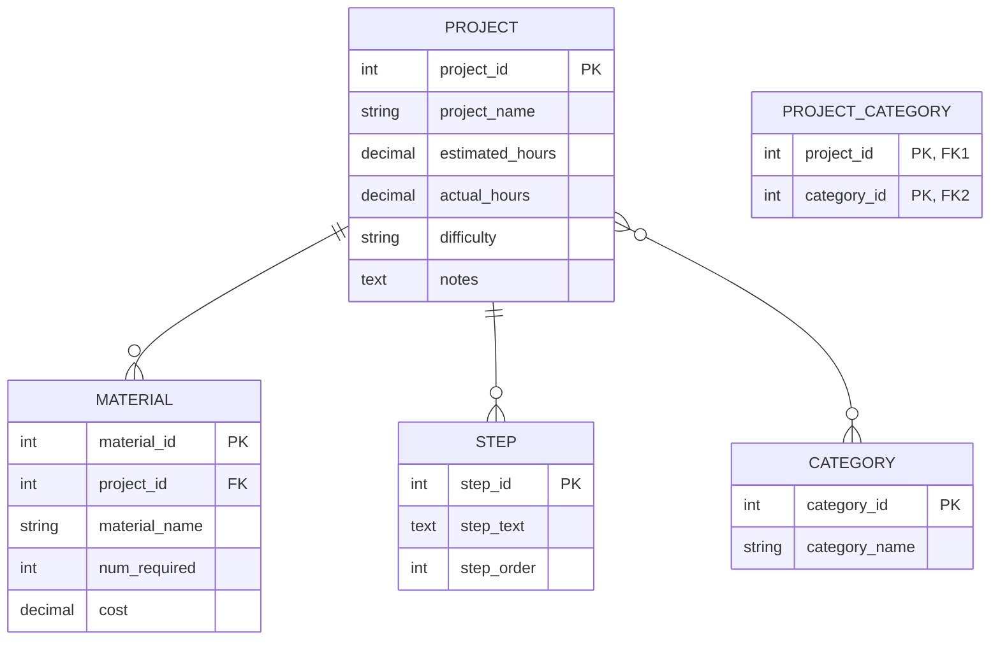

# Week 8 Assignment

Repository for submission for week 8 coding assignment.

## Background

You are in the process of creating an application that will perform CRUD (Create, Read, Update, and Delete) operations on a MySQL database. In the week 7 exercises, you wrote code to connect to a MySQL database using the Java Database Connectivity (JDBC) API. In these exercises, you will diagram the database tables using Draw.io to create an Entity-Relationship Diagram. You will then write the SQL statements to create the five project tables. Lastly, you will use a MySQL client (DBeaver) to create the tables.

## Objectives

In these exercises, you will:

-   Learn how to create an Entity-Relationship Diagram (ERD) in Draw.io with entities and relationship lines.

-   Learn about crows' foot notation and how to apply that knowledge in an Entity Relationship Diagram.

-   Apply your knowledge of `DROP TABLE` and `CREATE TABLE` statements to create tables using a MySQL client (DBeaver),

### Important

In the exercises below, you will see this icon: :camera:. This means to make sure that you include this functionality in your video showcase.

## Exercises

Use the column definitions in the table below for the Entity-Relationship Diagram (ERD) and the `CREATE TABLE` statements.

| Table            | Column            | Data Type    | Nullable | Comment                                    |
| ---------------- | ----------------- | ------------ | :------: | ------------------------------------------ |
| project          | `project_id`      | int          |    No    | primary key                                |
|                  | `project_name`    | varchar(128) |    No    |                                            |
|                  | `estimated_hours` | decimal(7,2) |   Yes    |                                            |
|                  | `actual_hours`    | decimal(7,2) |   Yes    |                                            |
|                  | `difficulty`      | int          |   Yes    |                                            |
|                  | `notes`           | text         |   Yes    |                                            |
|                  |                   |              |          |                                            |
| material         | `material_id`     | int          |    No    | primary key                                |
|                  | `project_id`      | int          |    No    | foreign key                                |
|                  | `material_name`   | varchar(128) |    No    |                                            |
|                  | `num_required`    | int          |   Yes    |                                            |
|                  | `cost`            | decimal(7,2) |   Yes    |                                            |
|                  |                   |              |          |                                            |
| step             | `step_id`         | int          |    No    | primary key                                |
|                  | `project_id`      | int          |    No    | foreign key                                |
|                  | `step_text`       | text         |    No    |                                            |
|                  | `step_order`      | int          |    No    |                                            |
|                  |                   |              |          |                                            |
| category         | `category_id`     | int          |    No    | primary key                                |
|                  | `category_name`   | varchar(128) |    No    |                                            |
|                  |                   |              |          |                                            |
| project_category | `project_id`      | int          |    No    | foreign key, unique key with `category_id` |
|                  | `category_id`     | int          |    No    | foreign key, unique key with `project_id`  |

### Entity-Relationship Diagram

Documenting a project is an essential skill so that the project will make sense to others who want to know about the project. This includes network diagrams, Entity-Relationship Diagrams, well-commented code and `README` files.

In this section, you will create an Entity-Relationship Diagram. This diagram will contain the five table entities and show the relationships between the tables. A good ERD can quickly orient future developers to the data that the application will work with.

Use your knowledge learned in the videos and follow the instructions in this section to create an Entity-Relationship Diagram of the DIY Projects schema.

1. Follow the instructions in the Week 8 Installation Instructions found in the resources packet to either download Draw.io or to use the online tool.

2. In Draw.io, create a new drawing and expand "Entity Relation" in the tool palette on the left.

3. Use Draw.io to create an Entity-Relationship Diagram. Save the file. The file must be uploaded to your GitHub repository for Week 8. Note that it should look similar to the diagram below.



### Project Schema

In this section, you will create a new file and write `DROP TABLE` and `CREATE TABLE` SQL statements for the five tables in the DIY Projects schema. The goal for this section is to copy the SQL statements from the file, drop them into the DBeaver SQL editor, and have DBeaver send the instructions to the MySQL server so that the five tables are created with no errors.

Creating the tables is the first step to having the application read from and write to them. Next week you will begin that process.

1. In the `mysql-java` project in Eclipse, create a file named `projects-schema.sql` in the `src/main/resources` directory.

2. Add `DROP TABLE` statements at the top of the file to drop the tables in the correct order. There can be some variation but the tables with dependencies (foreign key references to other tables) must be dropped first. The tables should only be dropped if they exist.

3. Write the `CREATE TABLE` statements in the inverse of the order that they were dropped. Include the following:

    &emsp;a. Auto-increment the primary key columns.

    &emsp;b. Primary key statements.

    &emsp;c. Foreign key statements with appropriate `ON DELETE CASCADE`.

4. Remember to close each `DROP TABLE` and `CREATE TABLE` statement with a semicolon.

5. Paste the SQL into the DBeaver SQL editor. Run all `DROP TABLE` and `CREATE TABLE` statements. Include your created tables as shown in DBeaver's connection explorer (leftmost panel) in your video. :camera: It should look like this:

    ```
    ├─ projects
    ├── Tables
    ├──├─ category
    ├──├─ material
    ├──├─ project
    ├──├─ project_category
    ├──└─ step
    ├── Views
    ├── Indexes
    ├── Procedures
    ├── Triggers
    └── Events
    ```

6. Push your project to GitHub.
