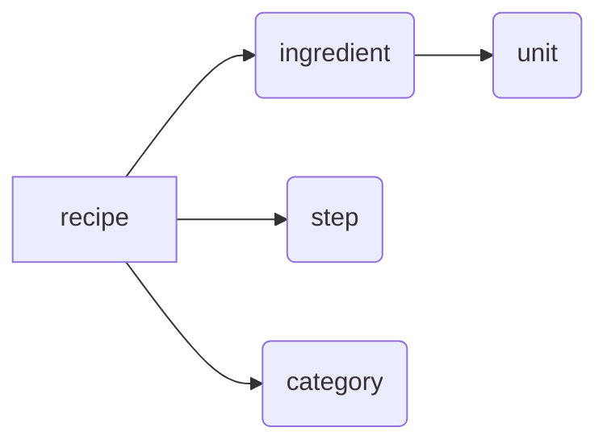

# Week 8 Curriculum

Notes from the week 8 MySQL video lessons.

## Week 7 Review

-   Difference between a database and a database client
-   Using Maven to manage dependencies
-   3-tier application design
-   The database connection and driver
-   How to connect to a database with JDBC

## Week 8 Overview

#### MySQL data types:

-   Integer
-   Decimal
-   Text
-   Date/time
-   Enum

#### Creating tables:

-   We will look at how to use the `CREATE TABLE` statement to create tables in **DBeaver** using the SQL editor

#### RDBMS Relationships:

-   Do a recap on **Java** relationship types: `has a`, `is a`, `uses a`
-   Look at the difference between **RDBMS** and **NoSQL**
-   Check out the **RDBMS** relationship types
    -   One-to-one
    -   One-to-many
    -   Many-to-many

#### Entity Relationship Diagrams:

-   We will see how to create an **Entity Relationship Diagram** in Draw.io
    -   Entities map to tables and columns
    -   Relationships are lines between entities
-   Relationship **types** are expressed using **Crows' Foot** notation
    -   Expresses **modality** — _e.g. optional or mandatory_
    -   Expresses **cardinality** — _e.g. one or many_

#### All about indexes:

-   **Speed** up reads
-   Enforce **uniqueness**
-   Specify **relationships**
    -   Primary key
    -   Foreign keys
-   Automatically **delete** child rows with `ON DELETE CASCADE`

## MySQL Data Types

### About data types

Just like Java, **MySQL** has different data types. MySQL supports all standard **SQL** data types. Many types come in various **sizes**.

-   Whole number types: `INT`

    -   Unlike Java, `INT`s can be signed or `UNSIGNED`. `INT` is a synonym of `INTEGER`.

        | MySQL Data Type  | Corresponding Java Type | Size in Bits |
        | ---------------- | :---------------------: | :----------: |
        | `TINYINT`        |          byte           |      8       |
        | `SMALLINT`       |          short          |      16      |
        | `MEDIUMINT`      |           --            |      24      |
        | `INT`, `INTEGER` |           int           |      32      |
        | `BIGINT`         |          long           |      64      |

-   Fixed precision type: `DECIMAL`
    -   `DECIMAL`s are defined with precision and scale
    -   **Precision** is the total number of digits stored (including decimal digits)
    -   **Scale** is the number of digits to the right of the decimal point
    -   **Example:** `DECIMAL(5, 2)` stores values from `-999.99` to `999.99`
    -   `DECIMAL` numbers are **exact** and can be used for money
    -   The Java class that corresponds to `DECIMAL` is `BigDecimal` — _not_ double
    -   May have round off issues, but they don't _accumulate_
-   Date and time types:
    -   `DATETIME`: `yyyy-mm-dd hh:mm:ss` format
    -   `TIMESTAMP` is the same as `DATETIME` but `TIMESTAMP` is **converted to UTC** when stored
    -   `DATE` (`yyyy-mm-dd`)
    -   `TIME` (`hh:mm:ss`)
    -   `YEAR` (`yyyy`)
-   Character types:
    -   `CHAR`: **fixed-width** storage (max=255)
    -   `VARCHAR`: **variable-width** storage (like a Java `String`)
-   Text types:

    | Type         | Max Length (characters) |
    | ------------ | ----------------------- |
    | `TINYTEXT`   | 2<sup>8</sup>           |
    | `TEXT`       | 2<sup>16</sup>          |
    | `MEDIUMTEXT` | 2<sup>24</sup>          |
    | `LONGTEXT`   | 2<sup>32</sup>          |

-   Enumerated type:
    -   `ENUM`: a single predefined value
        -   **Example:** `ENUM('one', 'two', 'three')` — the column must contain 'one', 'two', or 'three'
    -   Works well with Java `enum` type
-   Boolean type:
    -   `BOOLEAN`: value can be set to `TRUE` or `FALSE` _(or_ `1` _or_ `0`_)_
    -   `BOOLEAN` is **equivalent** `TINYINT(1)`
        -   _Note that the_ `(1)` _is a_ **display width**
        -   _It has_ **no effect** _on storage size_

### More on data

When a table is created, columns can be declared `NOT NULL`. This means the row **must have a value** for that column.

Columns can also be declared `NULL`. This means that the row may have **no value** in that column (i.e. the column is **nullable**).

If a column is not declared with `NULL` or `NOT NULL`, the column is **nullable**.

`DEFAULT` supplies a value if the inserted value is `NULL` — often used in `TIMESTAMP` or `DATETIME`.

```sql
TIMESTAMP NOT NULL
    DEFAULT CURRENT_TIMESTAMP
```

## Creating Tables

#### Recipes Database Tables:



### `CREATE TABLE` statement:

```sql
CREATE TABLE table_name (
    column_def_1, -- Comma
    column_def_2, -- Comma
    ...
    column_def_3 -- No comma
);
```

### Column definitions

**Syntax:** `name type modifiers [comma]`

-   In general, it's a good idea to add a **unique identifier** (`int`) to each row — this helps maintain relationships when forming relationships.
-   If a column has the `AUTO_INCREMENT` keyword, MySQL will automatically increment the value.

#### Example:

```sql
recipe_id INT AUTO_INCREMENT NOT NULL,
name VARCHAR(128) NOT NULL
```

#### Result:

| recipe_id | name              |
| --------- | ----------------- |
| 1         | Kitty Litter Cake |
| 2         | Apple Monsters    |
| 3         | Ice cubes         |
| 4         | Chocolate Moose   |

### Recipe table

| Name         | Type         | Modifier                           |
| ------------ | ------------ | ---------------------------------- |
| recipe_id    | INT          | AUTO_INCREMENT NOT NULL            |
| recipe_name  | VARCHAR(128) | NOT NULL                           |
| notes        | TEXT         |                                    |
| num_servings | INT          |                                    |
| prep_time    | TIME         |                                    |
| cook_time    | TIME         |                                    |
| created_at   | TIMESTAMP    | NOT NULL DEFAULT CURRENT_TIMESTAMP |

#### Recipe table `CREATE TABLE` statment:

```sql
CREATE TABLE recipe (
    recipe_id INT AUTO_INCREMENT NOT NULL,
    recipe_name VARCHAR(128) NOT NULL,
    notes TEXT,
    num_servings INT,
    prep_time TIME,
    cook_time TIME,
    created_at TIMESTAMP NOT NULL DEFAULT CURRENT_TIMESTAMP
);
```

### Category table

| Name          | Type        | Modifier                |
| ------------- | ----------- | ----------------------- |
| category_id   | INT         | AUTO_INCREMENT NOT NULL |
| category_name | VARCHAR(64) | NOT NULL                |

#### Category table `CREATE TABLE` statment:

```sql
CREATE TABLE category (
    category_id INT AUTO_INCREMENT NOT NULL,
    category_name VARCHAR(64) NOT NULL
);
```

### Unit table

| Name               | Type        | Modifier                |
| ------------------ | ----------- | ----------------------- |
| unit_id            | INT         | AUTO_INCREMENT NOT NULL |
| unit_name_singular | VARCHAR(32) | NOT NULL                |
| unit_name_plural   | VARCHAR(34) | NOT NULL                |

#### Unit table `CREATE TABLE` statment:

```sql
CREATE TABLE category (
    unit_id INT AUTO_INCREMENT NOT NULL,
    unit_name_singular VARCHAR(32) NOT NULL,
    unit_name_plural VARCHAR(34) NOT NULL
);
```

### Step table

| Name       | Type | Modifier                |
| ---------- | ---- | ----------------------- |
| step_id    | INT  | AUTO_INCREMENT NOT NULL |
| recipe_id  | INT  | NOT NULL                |
| step_order | INT  | NOT NULL                |
| step_text  | TEXT | NOT NULL                |

#### Step table `CREATE TABLE` statment:

```sql
CREATE TABLE step (
    step_id INT AUTO_INCREMENT NOT NULL,
    recipe_id INT NOT NULL,
    step_order INT NOT NULL,
    step_text TEXT NOT NULL
);
```

### Ingredient table

| Name             | Type         | Modifier                |
| ---------------- | ------------ | ----------------------- |
| ingredient_id    | INT          | AUTO_INCREMENT NOT NULL |
| recipe_id        | INT          | NOT NULL                |
| unit_id          | INT          |                         |
| ingredient_name  | VARCHAR(64)  | NOT NULL                |
| instruction      | VARCHAR(64)  |                         |
| ingredient_order | INT          | NOT NULL                |
| amount           | DECIMAL(7,2) |                         |

#### Ingredient table `CREATE TABLE` statment:

```sql
CREATE TABLE ingredient (
    ingredient_id INT AUTO_INCREMENT NOT NULL,
    recipe_id INT NOT NULL,
    unit_id INT,
    ingredient_name VARCHAR(64) NOT NULL,
    instruction VARCHAR(64),
    ingredient_order INT NOT NULL,
    amount DECIMAL(7,2)
);
```

### Creating tables

-   **Primary** tables must be created **first**.
-   **Related** tables are created **last**.

### Deleting tables

`DROP TABLE table_name;`

-   Tables must be **dropped** in the _opposite order_ in which they are created.
    -   i.e. the **related** table is dropped **first**.

### Video Project: Add the `CREATE TABLE` Statements

-   First add `DROP TABLE` statements to reset things so we can run this multiple times without duplicating tables and data. Then add `CREATE TABLE` statements.

-   `recipe_category` table is a `JOIN` table — used to associate each recipe with a category _(i.e. `JOIN`s the `recipe` and `category` tables)_

## Relationships

### Java relationships:

### `Has a`

-   An object **has a**nother object _(inside it)_
-   Expressed through **instance variables**

#### Example — a car **has a**n engine:

```java
class Car {
    private Engine engine;
}
```

### `Is a`

-   An object **is a** type of another object
-   Expressed through **inheritance**

#### Example — a cow **is an** animal:

```java
class Animal {
    private String name;
}

class Cow extends Animal {
    String cowTag;
}
```

### `Uses a`

-   One object **uses a**nother object
-   Often expressed through **method variables**

#### Example — the `Formatter` object **uses a** `Util` object:

```java
class Formatter {
    String format(Thing thing) {
        Util util = new Util();
        return util.format(thing);
    }
}
```

## Database types

### Relational Database Management System (RDBMS):

-   **Can maintain** relationships among data
-   Scale **vertically** (e.g. by adding more RAM and cores) — *don't scale as easily as distributed databases do*
-   Speed up to **thousands** of transactions per second
-   Good when you **need relationships**

### NoSQL (distributed) databases:

-   **Difficulty maintaining** relationships
-   Scale **horizontally** (e.g. by adding more machines)
-   Speed up to **millions** of transactions per second
-   Good when you want data **without relationships**

### Recipe data:

-   Recipes have relationships
    -   Recipes have steps (`has a`)
    -   Recipes have ingredients (`has a`)
    -   Recipes have categories (`has a`)
    -   Categories have recipes (`has a`)
-   We need to use an RDBMS like MySQL

## RDBMS relationships

-   **One-to-one**:
    -   A Car has **one and only one** Engine
-   **One-to-many**:
    -   A recipe may have **many** steps
    -   Each step links to only **one** recipe
-   **Many-to-many**:
    -   A recipe may have **many** categories _(e.g. Mexican, Vegan, etc.)_
    -   A category may have **many** recipes _(e.g. Vegan tacos, Vegan burger, etc.)_

**One-to-many** and **many-to-many** — and generally **one-to-one** — are all `has a` relationships. RDBMSs do not naturally implement `is a` or `uses a` relationships.

You can _simulate inheritance_ with a **one-to-one** relationship:

**Animal table:**

| Column      | Value |
| ----------- | ----- |
| animal_id   | 1     |
| animal_name | Cow   |

**Cow table:**

| Column    | Value  |
| --------- | ------ |
| animal_id | 1      |
| cow_tag   | 123ABC |

But typically, everything would just go into a **single table**:

**Cow table:**

| Column      | Value  |
| ----------- | ------ |
| animal_id   | 1      |
| animal_name | Cow    |
| cow_tag     | 123ABC |

### How are relationships formed?

In an earlier lesson, we used the `AUTO_INCREMENT` keyword to have MySQL automatically increment the ID value. This ID is **unique** within the table. This unique ID is called the **primary key**.

#### Primary key relationships

A **relationship** is formed when one table has a **primary key** and another table **references** that value through a **foreign key**:

**Animal table:**

| Column        | Value | Key Type    |
| ------------- | ----- | ----------- |
| **animal_id** | **1** | primary key |
| animal_name   | Cow   |             |

**Cow table:**

| Column        | Value  | Key Type    |
| ------------- | ------ | ----------- |
| **animal_id** | **1**  | foreign key |
| cow_tag       | 123ABC |             |

#### One-to-one relationships

A one-to-one relationship requires a **primary key** on the main table and a **foreign key + unique key** on the related table:

**Cow table:**

| Column        | Value  | Key Type                  |
| ------------- | ------ | ------------------------- |
| **animal_id** | **1**  | foreign key, _unique key_ |
| cow_tag       | 123ABC |                           |

#### One-to-many relationships

A one-to-many relationship requires a **primary key** on the main table and a **foreign key** on the related table — i.e. no unique key.

**One recipe...**

`recipe` table:

| recipe_id | recipe_name     |
| --------- | --------------- |
| **1**     | Ice cubes       |
| 2         | Chocolate Moose |

**...has many steps**

`step` table:

| step_id | recipe_id | text                  |
| ------- | --------- | --------------------- |
| 1       | **1**     | Add water to tray     |
| 2       | **1**     | Place tray in freezer |

#### Many-to-many relationships

A many-to-many relationship requires a **join table**. Each main table has a **primary key**. The join table has **two foreign keys**.

`recipe` table:

| recipe_id | name        |
| --------- | ----------- |
| 1         | Ice cubes   |
| 2         | Vegan tacos |

`recipe_category` table:

| recipe_id | category_id |
| --------- | ----------- |
| 2         | 1           |
| 2         | 2           |

`category` table:

| category_id | name    |
| ----------- | ------- |
| 1           | Mexican |
| 2           | Vegan   |

<!-- ## Entity Relationship Diagrams -->

<!-- ## Indexes -->
